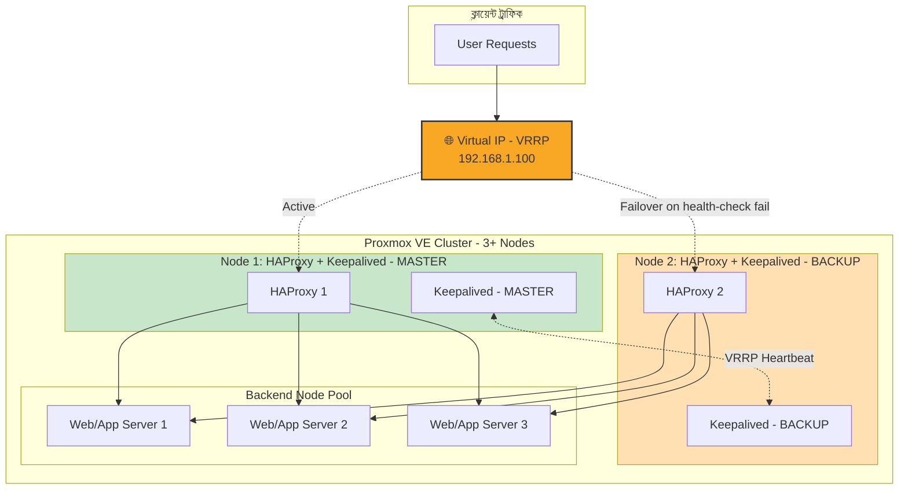

# Proxmox Cluster এ HAProxy ও Keepalived দিয়ে High-Availability Load Balancer

এই প্রজেক্টের লক্ষ্য হলো ৩টি বা তার বেশি Proxmox VE নোডের ক্লাস্টারে একটা **হাই-অ্যাভেইল্যাবল (HA) লোড ব্যালেন্সার** সেটআপ করা, যাতে যেকোনো একটা লোড ব্যালেন্সার সার্ভার ডাউন হয়ে গেলেও Virtual IP (VIP) ফেলওভারের মাধ্যমে সার্ভিস  চালু থাকে।

> **Status:** 🚧 পরিকল্পনা পর্যায়ে — শীঘ্রই কাজ শুরু হবে

---

##  উদ্দেশ্য

- সার্ভার ডাউনটাইম রোধ করা
- অটোমেটেড ইনফ্রাস্ট্রাকচার প্রোভিশনিং ও কনফিগারেশন
- প্রোডাকশন-গ্রেড HA আর্কিটেকচার নিয়ে হ্যান্ডস-অন অভিজ্ঞতা অর্জন

---

## 🛠️ মূল প্রযুক্তি

| প্রযুক্তি | ব্যবহার |
|---|---|
| **Proxmox VE** | ভার্চুয়ালাইজেশন প্ল্যাটফর্ম (৩+ নোড ক্লাস্টার) |
| **Terraform** | Proxmox-এ অটোমেটিক VM প্রোভিশনিং |
| **Cloud-Init** | VM বুট-টাইম কনফিগারেশন (hostname, SSH key, network) |
| **Ansible** | HAProxy ও Keepalived ইনস্টল ও কনফিগারেশন অটোমেশন |
| **HAProxy** | হেলথ চেক ও ট্রাফিক লোড ব্যালেন্সিং |
| **Keepalived** | VRRP এর মাধ্যমে Virtual IP (VIP) ফেলওভার |

---

## 🏗️ আর্কিটেকচার ডায়াগ্রাম

**কীভাবে কাজ করে:**
1. সব ইনকামিং ট্রাফিক একটা **Virtual IP (VIP)**-তে যায়, যেটা Keepalived ম্যানেজ করে।
2. স্বাভাবিক অবস্থায় VIP **MASTER** নোডের (Node 1) সাথে বাইন্ড থাকে।
3. Keepalived নিয়মিত **VRRP heartbeat** চেক করে MASTER ও BACKUP নোডের মধ্যে।
4. MASTER নোড ডাউন হলে, BACKUP নোড (Node 2) স্বয়ংক্রিয়ভাবে VIP টেকওভার করে নেয় — কোনো ম্যানুয়াল হস্তক্ষেপ ছাড়াই।
5. HAProxy প্রতিটা ব্যাকএন্ড সার্ভারে নিয়মিত **হেলথ চেক** চালায় এবং শুধু সুস্থ সার্ভারগুলোতে ট্রাফিক ফরওয়ার্ড করে।

---

## ✅ পরিকল্পিত কাজ (Roadmap)

- [ ] Terraform দিয়ে Proxmox-এ অটোমেটিক VM প্রোভিশনিং
- [ ] Cloud-Init দিয়ে বেস কনফিগারেশন (hostname, network, SSH key)
- [ ] Ansible প্লেবুক দিয়ে HAProxy ও Keepalived ইনস্টলেশন অটোমেশন
- [ ] Keepalived দিয়ে VRRP-বেসড Virtual IP ফেলওভার কনফিগার করা
- [ ] HAProxy-তে ব্যাকএন্ড হেলথ চেক ও লোড ব্যালেন্সিং অ্যালগরিদম সেটআপ
- [ ] ফেলওভার টেস্টিং — ইচ্ছাকৃতভাবে MASTER নোড বন্ধ করে সার্ভিস অ্যাভেইল্যাবিলিটি ভেরিফাই করা
- [ ] মনিটরিং ও লগিং যোগ করা (ঐচ্ছিক পরবর্তী ধাপ)

---

## 📌 নোট

এই README আপডেট হতে থাকবে যতই কাজ এগোবে। বর্তমানে প্রজেক্টটি প্ল্যানিং ও ইনফ্রাস্ট্রাকচার ডিজাইন পর্যায়ে আছে।
